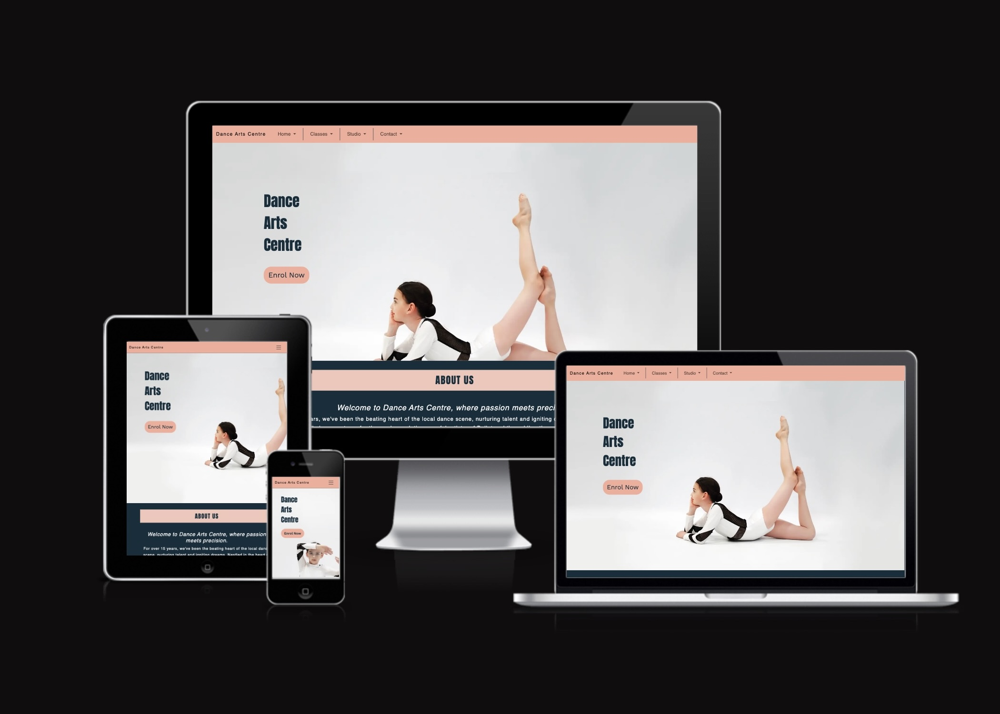
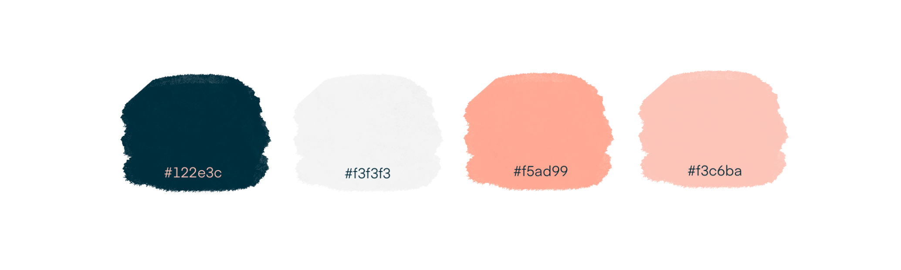
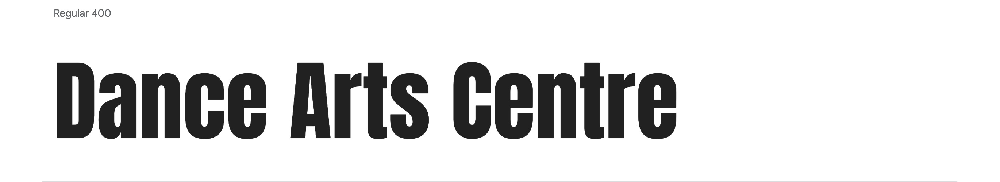
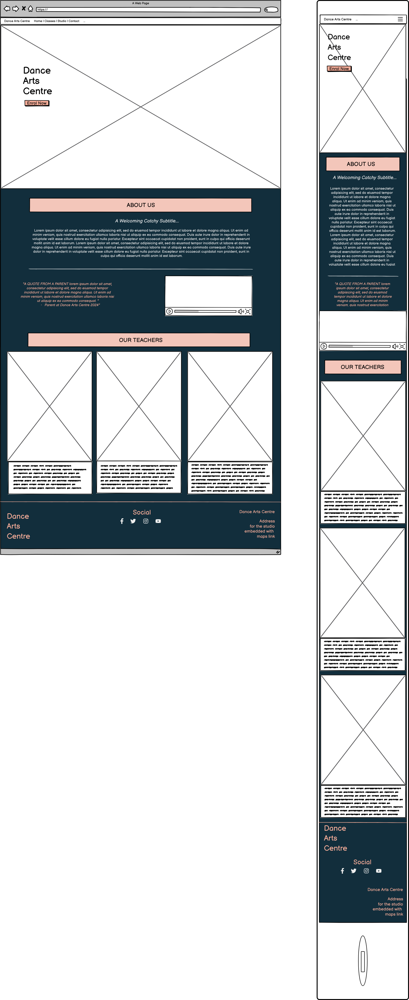
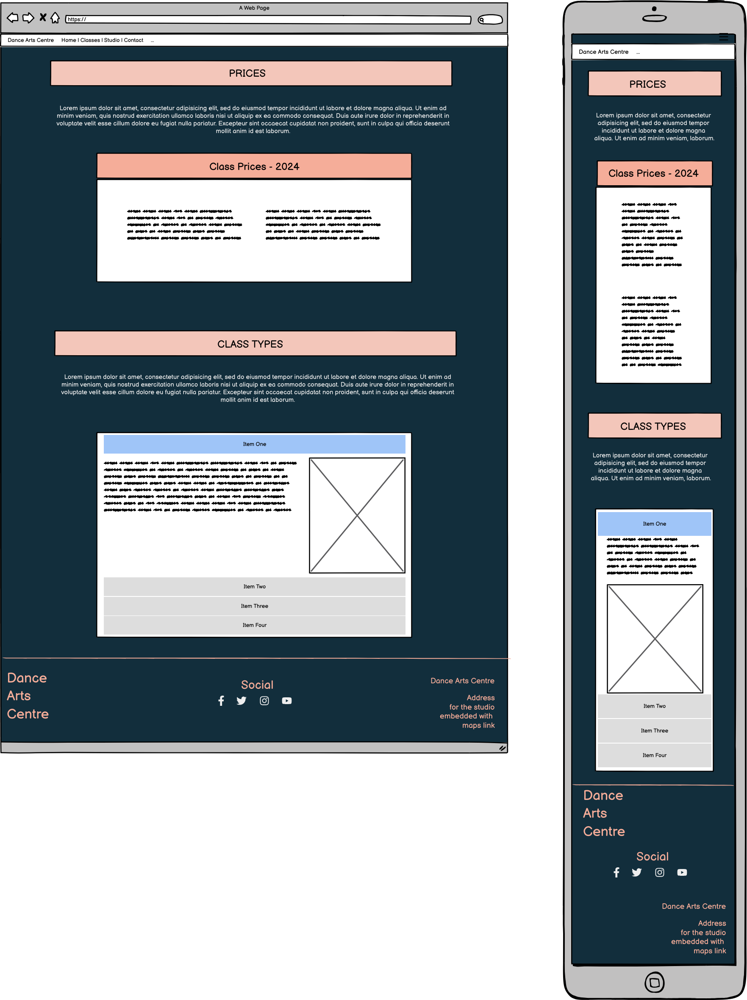
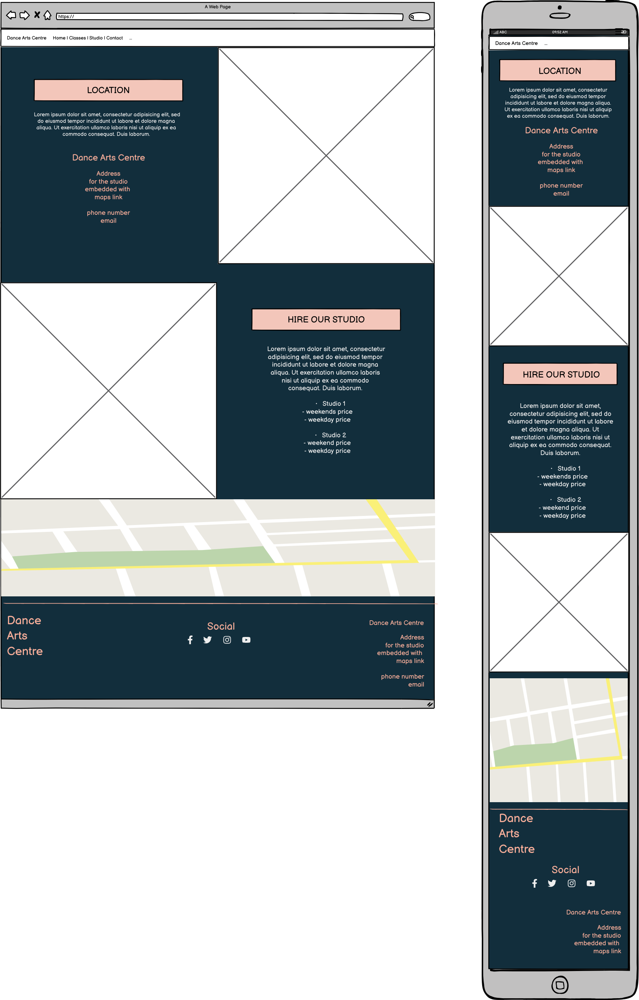
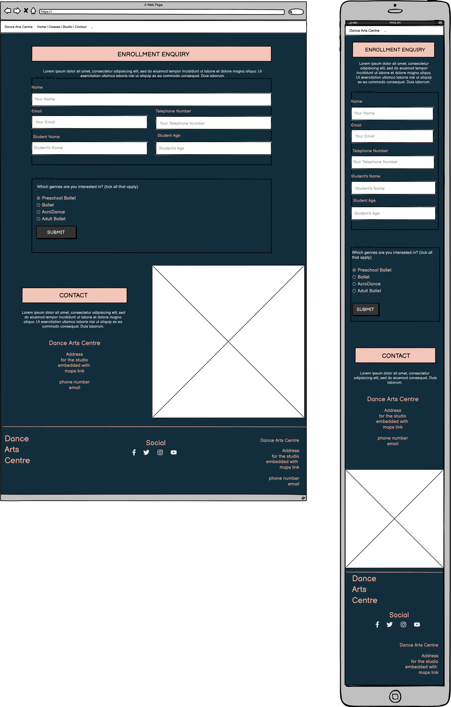

# Dance Arts Centre

Dance Arts Centre (DAC) is a site that hope to act as a positive reflection of a trustworthy and professional local dance school. It will enable new visitors to the site to enrol in classes via a contact form. Regular visitors can check the current timetable, find contact details and location, as well as updates. The client will be able to advertise the school and capture new visitor information via the sign up form.

-- additions: 
fonts: Google fonts, anton (logo text), Work Sans (main font)
images: hero images - pixabay ; user, sobima https://pixabay.com/users/sobima-4218005/
help adding mailto and tel to links elegantthemes.com
studio interior image: unsplash: user: Photo by <a href="https://unsplash.com/@tommykwak?utm_content=creditCopyText&utm_medium=referral&utm_source=unsplash">Tommy Kwak</a> on <a href="https://unsplash.com/photos/white-ceiling-with-light-fixture-Ta3OhYMKCvA?utm_content=creditCopyText&utm_medium=referral&utm_source=unsplash">Unsplash</a>

video embed: Video by Pressmaster: https://www.pexels.com/video/a-ballet-teacher-teaching-young-students-ballet-moves-and-forms-3120347/
  
Code: Colt Steele / Udemy / Full Stack Web Dev Course (responsive layout, order changes on small screens on Studio page)

# Dance Arts Centre
(Developer: Zoe Heathcote)

[Live webpage](https://zog08.github.io/Dance-Arts-Centre-MP1//)

## Table of Content

1. [Project Goals](#project-goals)
    1. [User Goals](#user-goals)
    2. [Site Owner Goals](#site-owner-goals)
2. [User Experience](#user-experience)
    1. [Target Audience](#target-audience)
    2. [User Requrements and Expectations](#user-requrements-and-expectations)
    3. [User Stories](#user-stories)
3. [Design](#design)
    1. [Design Choices](#design-choices)
    2. [Colour](#colours)
    3. [Fonts](#fonts)
    4. [Structure](#structure)
    5. [Wireframes](#wireframes)
4. [Technologies Used](#technologies-used)
    1. [Languages](#languages)
    2. [Frameworks & Tools](#frameworks-&-tools)
5. [Features](#features)
6. [Testing](#validation)
    1. [HTML Validation](#HTML-validation)
    2. [CSS Validation](#CSS-validation)
    3. [Accessibility](#accessibility)
    4. [Performance](#performance)
    5. [Device testing](#performing-tests-on-various-devices)
    6. [Browser compatibility](#browser-compatability)
    7. [Testing user stories](#testing-user-stories)
8. [Bugs](#Bugs)
9. [Deployment](#deployment)
10. [Credits](#credits)
11. [Acknowledgements](#acknowledgements)

## Project Goals 

### User Goals
- Parent / carer to find a dance school with classes relevant to their interests.
- Adult students finding classes for themselves.
- Find information about the dance school
- Find the location of the dance school.
- Ensure classes are being taught by trustworthy and professional teachers.
- Contact and enrol with the dance school.

### Site Owner Goals
- Increase in the number of customers / students.
- Promote the business in a professional fashion.
- Provide a way for new and existing customers to contact the business.
- Provide essential information about the business to customers.
- Capture new customers by providing upto date price list and easy to use contact form.

## User Experience

### Target Audience
- Adults looking for a place to take dance classes.
- Parents or carers looking to take their child to dance classes.
- Community groups or artists looking to hire a space to hire.

### User Requrements and Expectations

- A simple and intuitive navigation system
- Quickly and easily find relevant information
- Links and functions that work as expected
- Good presentation and a visually appealing design regardless of screen size
- An easy way to contact the business
- Simple content that the user can skim read
- Accessibility
- Photos of happy children / students

### User Stories

#### First-time User 
1. As a first time user, I want to know where the dance school is located.
2. As a first time user, I want to know the prices for classes.
3. As a first time user, I want to know more about the classes and teachers.
4. As a first time user, I want to get an idea and feel for the standard of teaching and the business.

#### Returning User
5. As a returning user, I want to see the location.
6. As a returnign user, I want to easily contact the school.
7. As a returning user, I want to see any changes to the prices.
8. As a returning user, I want to find the dance school on social media.
9. As a returning user, I want to find directions to the school.

#### Site Owner 
13. As the site owner, I want to be able to considerable cut admin time spent giving out basic information that you can now find on the website.
14. As the site owner, I want users to get to know the dance school and trust us with their children and their training.
15. As the site owner, I want the users to be able to contact us
15. As the site owner, I want the users to be able to capture new business with the enrol form and store sata safely.
15. As the site owner, I want the users to be able to find our location
15. As the site owner, I want the users to be able to hire our studio space.

## Design

### Design Choices
The webpage was designed to evoke the feeling of a calm and professional, modern business. Colours are traditional 'ballet pinks' coupled with a more masculine dark navy blue. The fonts are clean and simple. The photos show professionally shot classes and dance styles taught at the school. The teachers portraits are all in black and white for continuity. The navigation is simple and intuitive.

### Colour
The colour scheme was chosen for its good contrast (tested via webAIM for accessibility) and for its modern yet timeless appeal. The traditional ballet pink is offset by a strong and more masculine dark navy blue.
I ran a few different options through AI colour generator, [Huemint](https://huemint.com/brand-intersection/#palette=fdf8ef-122e3c-4184f7-f5ad99) which inspired the colour palette that I finally landed on. The Huemint site generated a royal blue colour alongside the pink and navy, but after testing it on the webpage the royal blue was confusing because it gave the appearance of a link to follow when used in text, so I removed that colour from the pallette.
I also tweaked the pale grey-cream colour to better suit the photos used; the original from Huemint was too 'yellow'.
 

### Fonts
Anton with sans serif as fallback was used for the logo and some headings. 
 

 
Work Sans with sans serif as fallback was used for the body. 
 

 
Both fonts are considered dyslexia friendly.
 
Both fonts were imported from Google Fonts

### Structure
The structure of the page is built in a recognisable and intuitive format. Upon arriving to the website the user sees a familiar type of navigation bar with the dance school name logo on the left side and the navigation links to the right. 
The website consists of four separate pages: 
- A homepage, with About Us, a customer quote with embedded video, About Teachers section.
- A Classes page, with prices and class types explained.
- A Studio page, with information on location, hire prices and an embedded Google map.
- A Contact page, with an enrollment form and contact details.

### Wireframes

Home

Classes

Location

Contact

## Technologies Used

### Languages
- HTML
- CSS

### Frameworks & Tools
- Bootstrap v5.3.3
- Git
- GitHub
- Gitpod
- Tinypng
- Unsplash.com
- Balsamiq
- Google Fonts
- Huemint.com
- Font Awsome
- Pixabay.com
- Pexels.com

## Features
The page consists of four pages and fourteen features

### Logo and Navigation Bar
- Featured on all four pages
- The navbar is fully responsive and changes to a toggler (hamburger menu) on smaller screens and includes
links to the Homepage, Classes, Studio and Contact pages.
- It allows users to easily navigate the page
- It sticks to the top of the page.
- The basic design of the responsive navbar was taken from Bootstrap. I changed the background colour of the bar and added divisions between the page links. When used on smaller screens, I removed the divisions and added a background colour when the links are clicked, to match the page branding.

### Carousel
- Introduces the user to the restaurant with a small three picture slide show
- Options for the user to navigate the slide show via back and forward arrows or indicators at the bottom

### News
- Allowes the user to see upcoming events or any news about the restaurant
- User stories covered: 13

### Meal-deal
- Allowes users to see what meal-deal is available for the upcoming Sunday
- User stories covered: 5

### Footer
- Featured on all five pages
- Consists of three seperate sections: contact information, opening times, and social media links
- User stories covered: 1, 6, 7, 10, 15

### About Us
- Gives a description of the restaurant and its facilities with a image of the front of the building on the right side
- User stories covered: 3, 14

### Customer reviews
- Features a few reviews left by the restaurants customers on social media
- User stories covered: 3

### Meet the Chef
- Features a short bio of the chef with an image of the chef on the left side
- User stories covered: 11

### Menu 
- Gives an overview of the menu in five sections: starters, main meals, kids meals, dessers, and wine.
- Each section of the menu is accompanied with an image of one of the items form the menu
- Features pricing
- User stories covered: 2, 8

### Image Gallery
- Imagery of the restaurant arranged in a grid
- User stories covered: 4

### Promo Video
- A YouTube video to promote the restaurant 
- User stories covered: 4

### Contact Form
- A way for user to provide feedback
- User stories covered: 9, 15

### Map
- Shows the restaurant location on an embeded Google Map
- User stories covered: 1, 12

### Info Box
- Provides the user with information about the restaurant including addres, phone number, email, and the name of the owner
- User stories covered: 7, 15

## Validation

### HTML Validation
The W3C Markup Validation Service was used to validate the HTML of the website. All pages pass with no errors no warnings to show.

Home

About

Menu

Gallery

Home

### CSS Validation
The W3C Jigsaw CSS Validation Service was used to validate the CSS of the website.
When validating the page as a whole, the validator shows some errors linked to Bootstrap v5.0. When validating just my own custom CSS it passes with no errors found and some warnings associated to using root variables.

whole page

style.css

### Accessibility
The WAVE WebAIM web accessibility evaluation tool was used to ensure the website met high accessibility standards. All pages pass with 0 errors.

Home

About

Menu

Gallery

Contact

### Performance 
Google Lighthouse in Google Chrome Developer Tools was used to test the performance of the website. 

Home

About

Menu

Gallery

Contact

### Performing tests on various devices 
The website was tested on the following devices:
- Lenovo Yoga 2 Pro (both in pc and tablet mode)
- Honor 20 pro
- Xiaomi Redmi Note 7

In addition, the website was tested using Google Chrome Developer Tools Device Toggeling option for all available device options.

### Browser compatability
The website was tested on the following browsers:
- Google Chrome
- Mozilla Firefox
- Microsoft Egde

### Testing user stories

1. As a first time user, I want to know where the restaurant is lokated

| **Feature** | **Action** | **Expected Result** | **Actual Result** |
|-------------|------------|---------------------|-------------------|
| Map | Navigate to the Contact Us page, locate the Google Map | Locating a map showing the location of the restaurant | Works as expected |
| Footer - contact information section | On any page scroll down to the footer | Find the address of the restaurant | Works as expected |

Screenshots

2. As a first time user, I want to know the price range

| **Feature** | **Action** | **Expected Result** | **Actual Result** |
|-------------|------------|---------------------|-------------------|
| Menu | Navigate to the Menu page | See prices on menu page | Works as expected |

Screenshots

3. As a first time user, I want to know more about the restaurant

| **Feature** | **Action** | **Expected Result** | **Actual Result** |
|-------------|------------|---------------------|-------------------|
| About Us | Navigate to the About page and locate the About Us section | Find description of the restaurant | Works as expected |
| Customer reviews | Navigate to the About page, scroll down to What our guests say section | Read customer reviews | Works as expected | 

Screenshots

4. As a first time user, I want to get a feel of what to expect at the restaurant

| **Feature** | **Action** | **Expected Result** | **Actual Result** |
|-------------|------------|---------------------|-------------------|
| Gallery | Navigate to the Gallery page | Find pictures of the restaurant and food served there | Works as expected |
| Promo video | Navigate to the GAlelry page and scroll to the promo video | Watch promo video | Works as expected |

Screenshots

5. As a returning user, I want to see the Sunday meal offer

| **Feature** | **Action** | **Expected Result** | **Actual Result** |
|-------------|------------|---------------------|-------------------|
| Meal-deal | On home page scroll down to the Sunday meal deal section | Find the meal-deal for the upcomming Sunday | Works as expected |

Screenshots

6. As a returnign user, I want to know the opening times

| **Feature** | **Action** | **Expected Result** | **Actual Result** |
|-------------|------------|---------------------|-------------------|
| Footer - opening times section | On any page scroll to the footer | See opening times | Works as expected |

Screenshots

7. As a returning user, I want to find a phone number to call for reservation

| **Feature** | **Action** | **Expected Result** | **Actual Result** |
|-------------|------------|---------------------|-------------------|
| Footer - contact information section | On any page scroll to the footer | See phone number | Works as expected |
| Info Box | Navigate to Contact Us page and locate the How to find us section | See phone number | Works as expected |

Screenshots

8. As a returning user, I want to see the menu

| **Feature** | **Action** | **Expected Result** | **Actual Result** |
|-------------|------------|---------------------|-------------------|
| Menu | Navigate to the menu page | Read the menu | Works as expected |

Screenshots

9. As a returning user, I want to leave some comment, suggestion or message to the staff

| **Feature** | **Action** | **Expected Result** | **Actual Result** |
|-------------|------------|---------------------|-------------------|
| Contact Form | Navigate to the Contact Us Page and locate the contact form, fill out and submit contact form | Data submited via contact form | Works as expectd |

Screenshots

10. As a returning user, I want to find the restaurant on social media

| **Feature** | **Action** | **Expected Result** | **Actual Result** |
|-------------|------------|---------------------|-------------------|
| Footer - social media section | On any page scroll to the bottom | Click on social media links | Works as expected | 

Screenshots

11. As a returning user, I want to know who is preparing the food

| **Feature** | **Action** | **Expected Result** | **Actual Result** |
|-------------|------------|---------------------|-------------------|
| Meet the Chef | Navigate to the About page and scroll down to Meet the Chef section | Find brief bio of the Chef | Works as expected |

Screenshots

12. As a returning user, I want to get directions to the restaurant

| **Feature** | **Action** | **Expected Result** | **Actual Result** |
|-------------|------------|---------------------|-------------------|
| Map | Navigate to the Contact Us page, locate the map and click on directions link | See directions to the restaurant on Goole Maps | Works as expected |

Screenshots

13. As the site owner, I want users to find news about upcoming events or changes in opening times

| **Feature** | **Action** | **Expected Result** | **Actual Result** |
|-------------|------------|---------------------|-------------------|
| News | Scroll down on home page and locate news section | Find latest news | Works as expected |

Screenshots

14. As the site owner, I want users to get to know the restaurant 

| **Feature** | **Action** | **Expected Result** | **Actual Result** |
|-------------|------------|---------------------|-------------------|
| About Us | Navigate to About page and locate About Us section | See relevant information about the restaurant | Works as expected |

Screenshots

15. As the site owner, I want the users to be able to contact us

| **Feature** | **Action** | **Expected Result** | **Actual Result** |
|-------------|------------|---------------------|-------------------|
| Contact Form | Navigate to the Contact Us Page and locate the contact form, fill out and submit contact form | Data submited via contact form | Works as expectd |
| Info Box | Navigate to Contact Us page and locate the How to find us section | Find the phone number | Works as expected |
| Footer - contact information section | On any page scroll down to the footer | Find the phone number | Works as expected |

Screenshots

## Bugs

| **Bug** | **Fix** |
| ----------- | ----------- |
| Home page link stays highlighted when visiting another page | Change active atribute to the correct page |
| The user can submit a contact form input without a message | Add required attribute to message input field |
| Navbar divides into two rows on xs screen size | Add a media query to remove the right margin of the logo in the navbar on xs screen |
| Email overflows on xs screen size | Add a media query that makes the divs spread to 100% width on xs sreens to froce the content onto a seperate line |
| When viewed on tablets, the contact page has whitespace after the footer | Set min-height for body to 100vh |

## Deployment
The website was deployed using GitHub Pages by following these steps:
1. In the GitHub repository navigate to the Settings tab
2. On the left hand menu select Pages
3. For the source select Branch: master
4. After the webpage refreshes automaticaly you will se a ribbon on the top saying: "Your site is published at https://4n4ru.github.io/CI_MS1_BodelschwingherHof/"

You can for fork the repository by following these steps:
1. Go to the GitHub repository
2. Click on Fork button in upper right hand corner

You can clone the repository by following these steps:
1. Go to the GitHub repository 
2. Locate the Code button above the list of files and click it 
3. Select if you prefere to clone using HTTPS, SSH, or Github CLI and click the copy button to copy the URL to your clipboard
4. Open Git Bash
5. Change the current working directory to the one where you want the cloned directory
6. Type git clone and paste the URL from the clipboard ($ git clone https://github.com/YOUR-USERNAME/YOUR-REPOSITORY)
7.Press Enter to create your local clone.

## Credits
Images not referenced below are owned by the developer.

### Media
In order of apearance:
- [carousel-1](assets/images/carousel-1.jpg): Photo by <a href="https://unsplash.com/@heathergill?utm_source=unsplash&utm_medium=referral&utm_content=creditCopyText">Heather Gill</a> on <a href="https://unsplash.com/s/photos/pots-and-pans?utm_source=unsplash&utm_medium=referral&utm_content=creditCopyText">Unsplash</a>
- [news](assets/images/news.jpg): Photo by <a href="https://unsplash.com/@mareksminder?utm_source=unsplash&utm_medium=referral&utm_content=creditCopyText">Claudia Altamimi</a> on <a href="https://unsplash.com/?utm_source=unsplash&utm_medium=referral&utm_content=creditCopyText">Unsplash</a>
- [meal-deal](assets/images/meal-deal.jpg): Photo by <a href="https://unsplash.com/@itssammoqadam?utm_source=unsplash&utm_medium=referral&utm_content=creditCopyText">Sam Moqadam</a> on <a href="https://unsplash.com/?utm_source=unsplash&utm_medium=referral&utm_content=creditCopyText">Unsplash</a> 
- [chef](assets/images/chef.jpg): <a href='https://www.freepik.com/photos/food'>Food photo created by freepik - www.freepik.com</a>
- [menu background](assets/images/menu-background.jpg): <a href="https://www.freepik.com/vectors/background">Background vector created by pikisuperstar - www.freepik.com</a>
- [starter](assets/images/starter.jpg) Photo by <a href="https://unsplash.com/@margzu?utm_source=unsplash&utm_medium=referral&utm_content=creditCopyText">Margarita Zueva</a> on <a href="https://unsplash.com/?utm_source=unsplash&utm_medium=referral&utm_content=creditCopyText">Unsplash</a>
- [main meal](assets/images/main-meal.jpg) Photo by <a href="https://unsplash.com/@keriliwi?utm_source=unsplash&utm_medium=referral&utm_content=creditCopyText">Keriliwi</a> on <a href="https://unsplash.com/?utm_source=unsplash&utm_medium=referral&utm_content=creditCopyText">Unsplash</a>
- [kids meal](assets/images/kids-meal.jpg) Photo by <a href="https://unsplash.com/@itssammoqadam?utm_source=unsplash&utm_medium=referral&utm_content=creditCopyText">Sam Moqadam</a> on <a href="https://unsplash.com/?utm_source=unsplash&utm_medium=referral&utm_content=creditCopyText">Unsplash</a>
- [dessert](assets/images/dessert.jpg) Photo by <a href="https://unsplash.com/@almapapi?utm_source=unsplash&utm_medium=referral&utm_content=creditCopyText">Krisztina Papp</a> on <a href="https://unsplash.com/?utm_source=unsplash&utm_medium=referral&utm_content=creditCopyText">Unsplash</a>
- [wine](assets/images/wine.jpg) Photo by <a href="https://unsplash.com/@biljaminai?utm_source=unsplash&utm_medium=referral&utm_content=creditCopyText">Biljana Martinic</a> on <a href="https://unsplash.com/?utm_source=unsplash&utm_medium=referral&utm_content=creditCopyText">Unsplash</a>
- [salad](assets/images/salad.jpg): Photo by <a href="https://unsplash.com/@itssammoqadam?utm_source=unsplash&utm_medium=referral&utm_content=creditCopyText">Sam Moqadam</a> on <a href="https://unsplash.com/?utm_source=unsplash&utm_medium=referral&utm_content=creditCopyText">Unsplash</a>
- [fish](assets/images/fish.jpg): Photo by <a href="https://unsplash.com/@itssammoqadam?utm_source=unsplash&utm_medium=referral&utm_content=creditCopyText">Sam Moqadam</a> on <a href="https://unsplash.com/?utm_source=unsplash&utm_medium=referral&utm_content=creditCopyText">Unsplash</a>
- [chicken](assets/images/chicken.jpg): Photo by <a href="https://unsplash.com/@itssammoqadam?utm_source=unsplash&utm_medium=referral&utm_content=creditCopyText">Sam Moqadam</a> on <a href="https://unsplash.com/?utm_source=unsplash&utm_medium=referral&utm_content=creditCopyText">Unsplash</a>
- [404 error image](assets/images/404-error.png): <a href='https://www.freepik.com/vectors/background'>Background vector created by freepik - www.freepik.com</a>
  
### Code
In order of apearance:
- The HTML for the responsive [Navbar with toggler](https://getbootstrap.com/docs/5.0/components/navbar/#toggler) was taken from the Bootstrap v5.0 documentation code snippet and combined with their [Navbar with Pills](https://getbootstrap.com/docs/5.0/components/navs-tabs/#pills)
- [Carousel](https://getbootstrap.com/docs/5.0/components/carousel/#with-indicators) on index page was taken from Bootrap v5.0 documentation code snippet
- CSS code to avoid whitespace below footer was taken from a forum post on [FreeCodeCamp](https://forum.freecodecamp.org/t/footer-white-space-below/191360)
- 404 page was build using description on [GitHub Docs](https://docs.github.com/en/pages/getting-started-with-github-pages/creating-a-custom-404-page-for-your-github-pages-site)

## Acknowledgements
I would like to take the opportunity to thank:
- My mentor Mo Shami for his feedback, advice, guidance and support.
- My husband Jure Runje for his support, advice, help with testing, and for giving me some kids free time to work on my project.
- To the lovely people on the Code Institute Slack for providing peer code reviews.
- My parents who own the restaurant that inspired this website

LOVE RUNNING TEMPLATE BELOW:

BELOW THIS LINE IS TEMPLATE README FROM LOVE RUNNING ETC TO CHANGE AND ADD TO!!!!!!

## Features 

In this section, you should go over the different parts of your project, and describe each in a sentence or so. You will need to explain what value each of the features provides for the user, focusing on who this website is for, what it is that they want to achieve and how your project is the best way to help them achieve these things.

### Existing Features

- __Navigation Bar__

  - Featured on all three pages, the full responsive navigation bar includes links to the Logo, Home page, Gallery and Sign Up page and is identical in each page to allow for easy navigation.
  - This section will allow the user to easily navigate from page to page across all devices without having to revert back to the previous page via the ‘back’ button. 

- __The landing page image__

  - The landing includes a photograph with text overlay to allow the user to see exactly which location this site would be applicable to. 
  - This section introduces the user to Love Running with an eye catching animation to grab their attention

- __Club Ethos Section__

  - The club ethos section will allow the user to see the benefits of joining the Love Running meetups, as well as the benefits of running overall. 
  - This user will see the value of signing up for the Love Running meetups. This should encourage the user to consider running as their form of exercise. 

- __Meetup Times section__

  - This section will allow the user to see exactly when the meetups will happen, where they will be located and how long the run will be in kilometers. 
  - This section will be updated as these times change to keep the user up to date. 

- __The Footer__ 

  - The footer section includes links to the relevant social media sites for Love Running. The links will open to a new tab to allow easy navigation for the user. 
  - The footer is valuable to the user as it encourages them to keep connected via social media

- __Gallery__

  - The gallery will provide the user with supporting images to see what the meet ups look like. 
  - This section is valuable to the user as they will be able to easily identify the types of events the organisation puts together. 

- __The Sign Up Page__

  - This page will allow the user to get signed up to Love Running to start their running journey with the community. The user will be able specify if they would like to take part in road, trail or both types of running. The user will be asked to submit their full name and email address. 

For some/all of your features, you may choose to reference the specific project files that implement them.

In addition, you may also use this section to discuss plans for additional features to be implemented in the future:

### Features Left to Implement

- Another feature idea

## Testing 

In this section, you need to convince the assessor that you have conducted enough testing to legitimately believe that the site works well. Essentially, in this part you will want to go over all of your project’s features and ensure that they all work as intended, with the project providing an easy and straightforward way for the users to achieve their goals.

In addition, you should mention in this section how your project looks and works on different browsers and screen sizes.

You should also mention in this section any interesting bugs or problems you discovered during your testing, even if you haven't addressed them yet.

If this section grows too long, you may want to split it off into a separate file and link to it from here.

### Validator Testing 

- HTML
  - No errors were returned when passing through the official [W3C validator](https://validator.w3.org/nu/?doc=https%3A%2F%2Fcode-institute-org.github.io%2Flove-running-2.0%2Findex.html)
- CSS
  - No errors were found when passing through the official [(Jigsaw) validator](https://jigsaw.w3.org/css-validator/validator?uri=https%3A%2F%2Fvalidator.w3.org%2Fnu%2F%3Fdoc%3Dhttps%253A%252F%252Fcode-institute-org.github.io%252Flove-running-2.0%252Findex.html&profile=css3svg&usermedium=all&warning=1&vextwarning=&lang=en#css)

### Unfixed Bugs

You will need to mention unfixed bugs and why they were not fixed. This section should include shortcomings of the frameworks or technologies used. Although time can be a big variable to consider, paucity of time and difficulty understanding implementation is not a valid reason to leave bugs unfixed. 

## Deployment

This section should describe the process you went through to deploy the project to a hosting platform (e.g. GitHub) 

- The site was deployed to GitHub pages. The steps to deploy are as follows: 
  - In the GitHub repository, navigate to the Settings tab 
  - From the source section drop-down menu, select the Master Branch
  - Once the master branch has been selected, the page will be automatically refreshed with a detailed ribbon display to indicate the successful deployment. 

The live link can be found here - https://code-institute-org.github.io/love-running-2.0/index.html 

## Credits 

In this section you need to reference where you got your content, media and extra help from. It is common practice to use code from other repositories and tutorials, however, it is important to be very specific about these sources to avoid plagiarism. 

You can break the credits section up into Content and Media, depending on what you have included in your project. 

### Content 

- The text for the Home page was taken from Wikipedia Article A
- Instructions on how to implement form validation on the Sign Up page was taken from [Specific YouTube Tutorial](https://www.youtube.com/)
- The icons in the footer were taken from [Font Awesome](https://fontawesome.com/)

### Media

- The photos used on the home and sign up page are from This Open Source site
- The images used for the gallery page were taken from this other open source site

Congratulations on completing your Readme, you have made another big stride in the direction of being a developer! 

## Other General Project Advice

Below you will find a couple of extra tips that may be helpful when completing your project. Remember that each of these projects will become part of your final portfolio so it’s important to allow enough time to showcase your best work! 

- One of the most basic elements of keeping a healthy commit history is with the commit message. When getting started with your project, read through [this article](https://chris.beams.io/posts/git-commit/) by Chris Beams on How to Write  a Git Commit Message 
  - Make sure to keep the messages in the imperative mood 

- When naming the files in your project directory, make sure to consider meaningful naming of files, point to specific names and sections of content.
  - For example, instead of naming an image used ‘image1.png’ consider naming it ‘landing_page_img.png’. This will ensure that there are clear file paths kept. 

- Do some extra research on good and bad coding practices, there are a handful of useful articles to read, consider reviewing the following list when getting started:
  - [Writing Your Best Code](https://learn.shayhowe.com/html-css/writing-your-best-code/)
  - [HTML & CSS Coding Best Practices](https://medium.com/@inceptiondj.info/html-css-coding-best-practice-fadb9870a00f)
  - [Google HTML/CSS Style Guide](https://google.github.io/styleguide/htmlcssguide.html#General)

Getting started with your Portfolio Projects can be daunting, planning your project can make it a lot easier to tackle, take small steps to reach the final outcome and enjoy the process! 