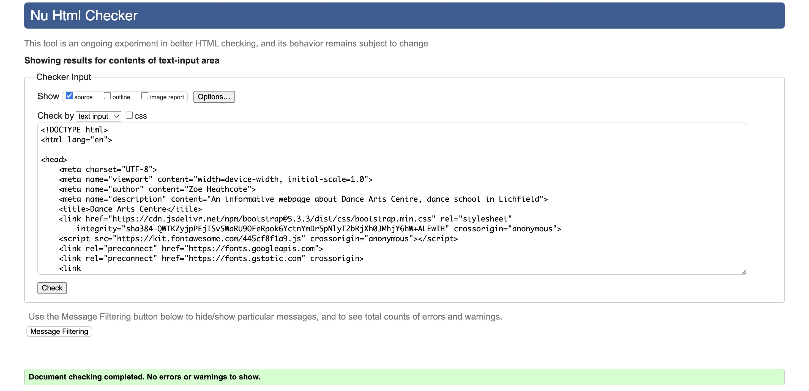
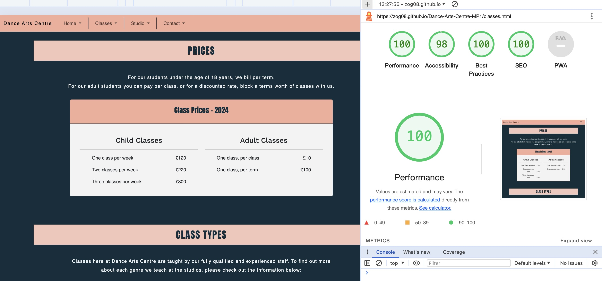

# Dance Arts Centre
Dance Arts Centre (DAC) is a site that hope to act as a positive reflection of a trustworthy and professional local dance school. It will enable new visitors to the site to enrol in classes via a contact form. Regular visitors can check the current timetable, find contact details and location, as well as updates. The client will be able to advertise the school and capture new visitor information via the sign up form.

# Dance Arts Centre
(Developer: Zoe Heathcote)

[Live webpage](https://zog08.github.io/Dance-Arts-Centre-MP1//)

## Table of Content

1. [Project Goals](#project-goals)
    1. [User Goals](#user-goals)
    2. [Site Owner Goals](#site-owner-goals)
2. [User Experience](#user-experience)
    1. [Target Audience](#target-audience)
    2. [User Requrements and Expectations](#user-requrements-and-expectations)
    3. [User Stories](#user-stories)
3. [Design](#design)
    1. [Design Choices](#design-choices)
    2. [Colour](#colours)
    3. [Fonts](#fonts)
    4. [Structure](#structure)
    5. [Wireframes](#wireframes)
4. [Technologies Used](#technologies-used)
    1. [Languages](#languages)
    2. [Frameworks & Tools](#frameworks-&-tools)
5. [Features](#features)
6. [Testing](#validation)
    1. [HTML Validation](#HTML-validation)
    2. [CSS Validation](#CSS-validation)
    3. [Accessibility](#accessibility)
    4. [Performance](#performance)
    5. [Device testing](#performing-tests-on-various-devices)
    6. [Browser compatibility](#browser-compatability)
    7. [Testing user stories](#testing-user-stories)
7. [Bugs](#Bugs)
8. [Future Features](#future-features)
9. [Deployment](#deployment)
10. [Credits](#credits)
11. [Acknowledgements](#acknowledgements)

## Project Goals 

### User Goals
- Parent / carer to find a dance school with classes relevant to their interests.
- Adult students finding classes for themselves.
- Find information about the dance school
- Find the location of the dance school.
- Ensure classes are being taught by trustworthy and professional teachers.
- Contact and enrol with the dance school.

### Site Owner Goals
- Increase in the number of customers / students.
- Promote the business in a professional fashion.
- Provide a way for new and existing customers to contact the business.
- Provide essential information about the business to customers.
- Capture new customers by providing upto date price list and easy to use contact form.

## User Experience

### Target Audience
- Adults looking for a place to take dance classes.
- Parents or carers looking to take their child to dance classes.
- Community groups or artists looking to hire a space to hire.

### User Requrements and Expectations

- A simple and intuitive navigation system
- Quickly and easily find relevant information
- Links and functions that work as expected
- Good presentation and a visually appealing design regardless of screen size
- An easy way to contact the business
- Simple content that the user can skim read
- Accessibility
- Photos of happy children / students

### User Stories

#### First-time User 
1. As a first time user, I want to know where the dance school is located.
2. As a first time user, I want to know the prices.
3. As a first time user, I want to know more about the classes.
4. As a first time user, I want to get an idea and feel for the standard of teaching and the business.

#### Returning User
5. As a returning user, I want to see the location.
6. As a returning user, I want to easily contact the school.
7. As a returning user, I want to see any changes to the prices.
8. As a returning user, I want to find the dance school on social media.

#### Site Owner 
9. As the site owner, I want to be able to considerable cut admin time spent giving out basic information that you can now find on the website.
10. As the site owner, I want users to get to know the dance school and trust us with their children and their training.
11. As the site owner, I want the users to be able to contact us
12. As the site owner, I want the users to be able to capture new business with the enrol form and store sata safely.
13. As the site owner, I want the users to be able to find our location
14. As the site owner, I want the users to be able to hire our studio space.

## Design

### Design Choices
The webpage was designed to evoke the feeling of a calm and professional, modern business. Colours are traditional 'ballet pinks' coupled with a more masculine dark navy blue. The fonts are clean and simple. The photos show professionally shot classes and dance styles taught at the school. The teachers portraits are all in black and white for continuity. The navigation is simple and intuitive.

### Colour
The colour scheme was chosen for its good contrast (tested via webAIM for accessibility) and for its modern yet timeless appeal. The traditional ballet pink is offset by a strong and more masculine dark navy blue.
I ran a few different options through AI colour generator, [Huemint](https://huemint.com/brand-intersection/#palette=fdf8ef-122e3c-4184f7-f5ad99) which inspired the colour palette that I finally landed on. The Huemint site generated a royal blue colour alongside the pink and navy, but after testing it on the webpage the royal blue was confusing because it gave the appearance of a link to follow when used in text, so I removed that colour from the pallette.
I also tweaked the pale grey-cream colour to better suit the photos used; the original from Huemint was too 'yellow'.
 

### Fonts
Anton with sans serif as fallback was used for the logo and some headings. 
 

 
Work Sans with sans serif as fallback was used for the body. 
 

 
Both fonts are considered dyslexia friendly.
 
Both fonts were imported from Google Fonts

### Structure
The structure of the page is built in a recognisable and intuitive format. Upon arriving to the website the user sees a familiar type of navigation bar with the dance school name logo on the left side and the navigation links to the right. 
The website consists of four separate pages (plus 404 error page): 
- A homepage, with About Us, a customer quote with embedded video, About Teachers section.
- A Classes page, with prices and class types explained.
- A Studio page, with information on location, hire prices and an embedded Google map.
- A Contact page, with an enrollment form and contact details.
- A 404 error page

### Wireframes

Home

Classes

Location

Contact

## Technologies Used

### Languages
- HTML
- CSS

### Frameworks & Tools
- Bootstrap v5.3.3
- Git
- GitHub
- Gitpod
- Tinypng
- Flaticon.com
- Balsamiq
- Mockup ios app
- Google Fonts
- Huemint.com
- Font Awsome
- Pixabay.com
- Pexels.com
- Openai ChatGPT

## Features
The page consists of four pages and fourteen features

### Logo and Navigation Bar
- Featured on all four pages
- The navbar is fully responsive and changes to a toggler (hamburger menu) on smaller screens and includes
links to the Homepage, Classes, Studio and Contact pages.
- It allows users to easily navigate the page
- It sticks to the top of the page.
- The basic design of the responsive navbar was taken from Bootstrap. I changed the background colour of the bar and added divisions between the page links. When used on smaller screens, I removed the divisions and added a background colour when the links are clicked, to match the page branding.

### Hero Image
- Introduces the user to the dance school with a large cover image. Landscape on medium and above screens. Different portrait oriented image for small screens.
- Overlayed on the hero image is a text logo of Dance Arts Centre and a call to action button to enrol now.
- The hero images convey a professional and modern dance school and tie in with the colour branding. I enjoy how the girl is looking at the enrol button, drawing you eye to the action. 
- User stories covered: 4

### Enrol Button
- A media query makes the button wiggle when the home page is loaded, drawing youo eye to the button.
- Links directly to the enrollment form on the Contact page
- Both image sizes flow visually to the call to action button.
- User stories covered: 11

### About Us
- Allowes users to see an introduction to the school and an overview of the services they provide
- User stories covered: 4, 9

### Quote
- Quote from a parent at the dance school. This helps gain new parents trust.
- User stories covered: 4

### Video
- A short video, with no audio, autoplays when browser is loaded. 
- It loops to play again once finished.
- A video of a real class at the dance school, which gives an insight into classes.
- User stories covered: 3, 10

### Teacher Cards
- Gives a description of the teaching staff, along with an image
- Helps gain the trust of new parents
- Presents a standard of professionalism and shows the staff qualifications etc.
- User stories covered: 4, 9, 10

### Footer
- Featured on all four pages
- Consists of three seperate sections: text logo that links back to home page, social media links and contact info that links to a new tab with Google map / email / phone call.
- User stories covered: 1, 5, 6, 8, 9, 11, 13

### Prices
- Consists of heading, short text information and prices available in an easy to read format in a responsive table.
- User stories covered: 2, 7, 9

### Class Types
- An accordion style drop down menu, each section contains an explanation of the dance genre along with a photo.
- Responsive design. Basis taken from Bootstrap, responsive images added through my own trial and error.
- Headingsin the accordion change to pale pink background when a section is opened.
- User stories covered: 3, 9, 10

 

### Location
- Location explained with an address and whereabouts in the building itself.
- Address is a link to Google map directions, opens in a new tab.
- Phone number is linked to call the number on phone.
- Email is linked to open email app and send communication.
- Clear photo of the outside of the building.
- Text stacks above photo on small screens.
- A way for studio owner to cut down on admin time by offering basic information.
- User stories covered: 1, 5, 9, 11, 13

### Studio Hire 
- A bulleted list of studio hire prices
- A clear photo of the studio from the inside
- On small screens, photo and text stack on top of each other. In this section, the containers reverse order at smal size so the text information comes first.
- User stories covered: 2, 9, 4

### Google Map
- Embed of Google Map to show location of the studio in the City, with closest parking marked.
- User stories covered: 1, 5, 9, 13

### Enrollment Contact Form
- A way for the user to enrol in classes
- A way for studio owner to capture new business 
- User stories covered: 6, 11, 12

### Contact Us
- A way for user to provide feedback by another method
- Phone, email, google map all linked by opening in new tab
- A way for the studio owner to help their existing and new customers
- User stories covered: 1, 5, 6, 9, 11, 13

## Validation

### HTML Validation
The W3C Markup Validation Service was used to validate the HTML of the website. All pages pass with no errors no warnings to show.

Home

Classes

Studio

Gallery

### CSS Validation
The W3C Jigsaw CSS Validation Service was used to validate the CSS of the website.
When validating the page as a whole, the validator shows some errors linked to Bootstrap v5.0. When validating just my own custom CSS it passes with no errors found and some warnings associated to using root variables.

style.css

### Accessibility
The WAVE WebAIM web accessibility evaluation tool was used to ensure the website met high accessibility standards. All pages pass with 0 errors or contrast errors.
There were a couple of warnings regarding skipped headings, but over the four pages, this was unavoidable and the headings were kept as successive possible within this limitation.

Home

Classes

Studio

Contact

### Performance 
Google Lighthouse in Google Chrome Developer Tools was used to test the performance of the website. 
A few issues were flagged regarding the skipped headings that I feel is unavoidable over the four pages.
When viewed in a normal Chrome tab, lighthouse flagged external cookies regarding the Google Map. These are out ofmy control, and when Lighthouse is performed from an incognito window these issues are no longer present

Home

Classes

Studio

Contact

### Performing tests on various devices 
The website was tested on the following devices:
- Ipad Pro 12.9" (landscape and portrait)
- Apple Macbook Air 13"
- Iphone 14 pro (landscape and portrait)
- Iphone SE (original version, landscape and portrait)
- Google Pixel 7 (landscape and portrait)

In addition, the website was tested using Google Chrome Developer Tools Device Toggeling option for all available device options.

### Browser compatability
The website was tested on the following browsers:
- Chrome
- Safari
- Firefox

### Testing user stories

1. As a first time user, I want to know where the dance school is located

| **Feature** | **Action** | **Expected Result** | **Actual Result** |
|-------------|------------|---------------------|-------------------|
| Map | Navigate to the Studio page, locate the Google Map | See a map showing dance school location | Works as expected |
| Footer - contact information section | On any page scroll down to the footer | Find the address of the dance school, click to open Google map if desired | Works as expected |
| Address | Navigate to Contact page, scroll down, find the address of the dance school. Click for Google map if desired | Works as expected |

Screenshots

2. As a first time user, I want to know the prices

| **Feature** | **Action** | **Expected Result** | **Actual Result** |
|-------------|------------|---------------------|-------------------|
| Class Prices | Navigate to the Classes page, scroll down to Class Prices | Find uptodate prices on Classes page | Works as expected |
| Studio Hire Prices | Navigate to Studio page, scroll down to Studio Hire Section | Find Studio Hire prices | Works as expected |

Screenshots

3. As a first time user, I want to know more about the classes

| **Feature** | **Action** | **Expected Result** | **Actual Result** |
|-------------|------------|---------------------|-------------------|
| Teachers section | Navigate to the About page and scroll down to locate the Teachers section | Find description of the teachers | Works as expected |
| Classes section | Navigate to the Classes page, scroll down to classes section, click on class type | Read about and see different class types | Works as expected | 

Screenshots

4. As a first time user, I want to get a feel for the standard of teaching and the business

| **Feature** | **Action** | **Expected Result** | **Actual Result** |
|-------------|------------|---------------------|-------------------|
| Hero Image | Navigate to the Home page | Professional Hero image displayed at the top of the screen showing a student | Works as expected |
| Quote | Navigate to the Home page and scroll to the video | Watch video | Works as expected |
| Teacher Cards | Navigate to Home page, scroll down to Teachers section | Read teacher info and see their images | Works as expected |

Screenshots

5. As a returning user, I want to see the location

| **Feature** | **Action** | **Expected Result** | **Actual Result** |
|-------------|------------|---------------------|-------------------|
| Map | Navigate to the Studio page, locate the Google Map | See a map showing dance school location | Works as expected |
| Footer - contact information section | On any page scroll down to the footer | Find the address of the dance school, click to open Google map if desired | Works as expected |
| Address | Navigate to Contact page, scroll down, find the address of the dance school. Click for Google map if desired | Works as expected |

Screenshots

6. As a returning user, I want to easily contact the school

| **Feature** | **Action** | **Expected Result** | **Actual Result** |
|-------------|------------|---------------------|-------------------|
| Footer - contact details | On any page scroll to the footer | See contact details, clink on links to contact by email / phone / address | Works as expected |
| Enrollment Contact Form | Navigate to Contact page | Fill in contact form, submit information to send to studio owner | Works as expected |
| Contact Section | Navigate to Contact page, scroll down to Contact section | See contact details, clink on links to contact by email / phone / address | Works as expected |

Screenshots

7. As a returning user, I want to find any changes to the prices

| **Feature** | **Action** | **Expected Result** | **Actual Result** |
|-------------|------------|---------------------|-------------------|
| Class Prices | Navigate to the Classes page, scroll down to Class Prices | Find uptodate prices on Classes page | Works as expected |
| Studio Hire Prices | Navigate to Studio page, scroll down to Studio Hire Section | Find Studio Hire prices | Works as expected |

Screenshots

8. As a returning user, I want to find the dance school on social media

| **Feature** | **Action** | **Expected Result** | **Actual Result** |
|-------------|------------|---------------------|-------------------|
| Footer | Navigate to the bottom of any of the pages | Find social media icons for Facebook, Twitter, Instagram, Youtube | Works as expected |

Screenshots

9. As the site owner, I want to be able to considreably cut admin time spent giving out basic information that you can now find on the website 

| **Feature** | **Action** | **Expected Result** | **Actual Result** |
|-------------|------------|---------------------|-------------------|
| About Us | Navigate to the Home Page, scroll down to the About Us section | Read general overview of the school | Works as expectd |
| Teacher Cards | Navigate to Home page, scroll down to Teachers section | Read teacher info and see their images | Works as expected |
| Footer | Navigate to the bottom of any of the pages | Find footer with contact information and social media icons | Works as expected |
| Class Prices | Navigate to the Classes page, scroll down to Class Prices | Find uptodate prices on Classes page | Works as expected |
| Classes section | Navigate to the Classes page, scroll down to classes section, click on class type | Read about and see different class types | Works as expected | 
| Location | Navigate to Contact page, scroll down to Location section | Find the address of the dance school. Click for Google map if desired | Works as expected |
| Studio Hire Prices | Navigate to Studio page, scroll down to Studio Hire Section | Find Studio Hire prices | Works as expected |
| Map | Navigate to the Studio page, locate the Google Map | See a map showing dance school location | Works as expected |
| Contact Section | Navigate to Contact page, scroll down to Contact section | See contact details, clink on links to contact by email / phone / address | Works as expected |

Screenshots

10. As the site owner, I want users to get to know the dance school and trust us with their children and their training

| **Feature** | **Action** | **Expected Result** | **Actual Result** |
|-------------|------------|---------------------|-------------------|
| Teacher Cards | Navigate to Home page, scroll down to Teachers section | Read teacher info and see their images | Works as expected |
| Video | Navigate to the Home page and scroll to the video | Watch video of an actual class | Works as expected |
| Classes section | Navigate to the Classes page, scroll down to classes section, click on class type | Read about and see different class types | Works as expected | 

Screenshots

11. As a site owner, I want the users to be able to contact us 

| **Feature** | **Action** | **Expected Result** | **Actual Result** |
|-------------|------------|---------------------|-------------------|
| Footer - contact details | On any page scroll to the footer | See contact details, clink on links to contact by email / phone / address | Works as expected |
| Enrollment Contact Form | Navigate to Contact page | Fill in contact form, submit information to send to studio owner | Works as expected |
| Contact Section | Navigate to Contact page, scroll down to Contact section | See contact details, clink on links to contact by email / phone / address | Works as expected |

Screenshots

12. As the site owner, I want to be able to be able to capture new business effectively with the enrol form to help store data safely

| **Feature** | **Action** | **Expected Result** | **Actual Result** |
|-------------|------------|---------------------|-------------------|
| Enrollment Contact Form | Navigate to Contact page | Fill in contact form, submit information to send to studio owner | Works as expected |

Screenshots

13. As the site owner, I want users to be able to find our location

| **Feature** | **Action** | **Expected Result** | **Actual Result** |
|-------------|------------|---------------------|-------------------|
| Map | Navigate to the Studio page, locate the Google Map | See a map showing dance school location | Works as expected |
| Footer - contact information section | On any page scroll down to the footer | Find the address of the dance school, click to open Google map if desired | Works as expected |
| Address | Navigate to Contact page, scroll down, find the address of the dance school. Click for Google map if desired | Works as expected |

Screenshots

14. As the site owner, I want the users to be able to hire our studio space

| **Feature** | **Action** | **Expected Result** | **Actual Result** |
|-------------|------------|---------------------|-------------------|
| Studio Hire Prices | Navigate to Studio page, scroll down to Studio Hire Section | Find Studio Hire prices | Works as expected |

Screenshots

## Bugs

| **Bug** | **Fix** |
| ----------- | ----------- |
| Doesnt navigate to Contact section when clicking on Contact link in navbar | corrected the spelling of the id in html |
| Navbar divides into two rows on xs screen size | made a very slight adjustment to the font size |
| The user couldn't submit the form when inputting a numerical age | corrected field input to number, instead of email |
| Background image cut off on wider monitors | Corrected the positioning to background-position-y as align-contents only affects the contents; the text or buttons |

## Future Features 
In the future, if more time allowed and my skills are furthered, i would like to add the following features:
- Members only area. Parents could sign in and see news, timetable and photos of their children that may not be appropriate to share with the general public
- Take payment via the website for classes
- A shop to sell uniform

## Deployment
The website was deployed using GitHub Pages by following these steps:
1. In the GitHub repository navigate to the Settings tab
2. On the left hand menu select Pages
3. For the source select Branch: master
4. After the webpage refreshes automaticaly you will se a ribbon on the top saying: "Your site is published at https://zog08.github.io/Dance-Arts-Centre-MP1/"

You can fork the repository by following these steps:
1. Go to the GitHub repository
2. Click on Fork button in upper right hand corner

You can clone the repository by following these steps:
1. Go to the GitHub repository 
2. Locate the Code button above the list of files and click it 
3. Select if you prefere to clone using HTTPS, SSH, or Github CLI and click the copy button to copy the URL to your clipboard
4. Open Git Bash
5. Change the current working directory to the one where you want the cloned directory
6. Type git clone and paste the URL from the clipboard ($ git clone https://github.com/YOUR-USERNAME/YOUR-REPOSITORY)
7. Press Enter to create your local clone.

## Credits
Images not referenced below are owned by the developer.

### Media
In order of apearance:
- [hero-image-landscape](assets/images/hero-image.webp): Photo by <a href="https://pixabay.com/users/sobima-4218005/">Sobima</a> on <a href="https://pixabay.com/photos/ballet-ballerina-dance-girl-5352240">Pixabay</a>
- [hero-image-portrait](assets/images/hero-portrait.webp): Photo by <a href="https://pixabay.com/users/sobima-4218005/">Sobima</a> on <a href="https://pixabay.com/photos/ballet-ballerina-dance-girl-5352241/">Pixabay</a>
- [ballet-class-video](assets/videos/ballet-class-video.mp4): Video by <a href="https://www.pexels.com/@pressmaster/">Pressmaster</a> on <a href="https://www.pexels.com/video/a-ballet-teacher-teaching-young-students-ballet-moves-and-forms-3120347/">Pexels</a>
- [teacher1](assets/images/teacher1.webp): Photo by <a href="https://pixabay.com/users/anagomes2-3976914/">anagomes2</a> on <a href="https://pixabay.com/photos/black-woman-woman-brasileira-female-1898482/">Pixabay</a>
- [teacher2](assets/images/teacher2.webp): Photo by <a href="https://pixabay.com/users/moonrid3r-8164253/">MoonRid3r</a> on <a href="https://pixabay.com/photos/portrait-adult-woman-3204843/">Pixabay</a>
- [teacher3](assets/images/teacher3.webp): Photo by <a href="https://pixabay.com/users/streetwindy-11524310/">Streetwindy</a> on <a href="https://pixabay.com/photos/portrait-man-boy-masculine-4444764/">Pixabay</a>
- [ballet](assets/images/ballet.webp): Photo by <a href="https://pixabay.com/users/sobima-4218005/">Sobima</a> on <a href="https://pixabay.com/photos/ballet-ballerina-dance-girl-5352226/">Pixabay</a>
- [acroclass](assets/images/acroclass.webp): Photo by <a href="https://www.freepik.com/">Freepik</a> on <a href="https://www.freepik.com/free-photo/young-woman-assisting-ballerina-girl-dance-class_2690245.htm">Freepik</a>
- [babyballet](assets/images/babyballet.webp): Photo by <a href="https://www.freepik.com/author/prostooleh">Prostooleh</a> on <a href="https://www.freepik.com/free-photo/cute-little-ballerinas-pink-ballet-costume-children-pointe-shoes-is-dancing-room-kid-dance-class_11155226.htm#fromView=image_search_similar&page=2&position=5&uuid=1d453208-8f90-49c0-8100-fb6f247b44a5">Freepik</a>
- [adultballet](assets/images/adultballet.webp): Photo by <a href="https://www.freepik.com/author/master1305">Master1305</a> on <a href="https://www.freepik.com/free-photo/seven-ballerinas-ballet-bar_7540238.htm">Freepik</a>
- [building](assets/images/building.webp): Photo by <a href="https://commons.wikimedia.org/wiki/User:Bs0u10e01">Bs0u10e01</a> on <a href="https://en.m.wikipedia.org/wiki/File:St_Marys_Lichfield.jpg">Wikipedia</a>
- [studio-hire](assets/images/studio-hire.webp): Photo by <a href="https://unsplash.com/@tommykwak">Tommy Kwak</a> on <a href="https://unsplash.com/photos/white-ceiling-with-light-fixture-Ta3OhYMKCvA">Unsplash</a>
- [class](assets/images/class.webp): Photo by <a href="https://pixabay.com/users/sobima-4218005/">Sobima</a> on <a href="https://pixabay.com/photos/ballet-lesson-ballerina-girls-3362687/">Pixabay</a>
- [404-dancer](assets/images/dancer.png): Photo by <a href="https://www.flaticon.com/authors/smashingstocks">Smashingstocks</a> on <a href="https://www.flaticon.com/free-icon/dancer_7694952?term=ballet&page=1&position=7&origin=style&related_id=7694952">Flaticon</a>
 
- Text dialogue in About Us section, some text within Classes accordion made with help from <a href="https://openai.com/chatgpt">ChatGPT</a>

  
### Code
In order of apearance:
- The HTML for the responsive [Navbar with toggler](https://getbootstrap.com/docs/5.3/components/navbar/#nav) was taken from the Bootstrap v5.3 documentation code snippet and combined with my own colour and border styling to fit the schools branding
- The HTML for the responsive [teacher cards](https://getbootstrap.com/docs/5.3/components/card/#images-1) was taken from the Bootstrap v5.3 documentation code snippet and combined with my own styling and images from Pixabay.
- The HTML for the Classes [accordion](https://getbootstrap.com/docs/5.3/components/accordion/#example) was taken from the Bootstrap v5.3 documentation code snippet and combined with my own styling to add images and to change colour when the accordion is open to match the schools branding.
- Inspiration for the [Location](https://www.udemy.com/course/the-web-developer-bootcamp/) page, studio and hire section, and their responsiveness, was taken from Colt Steele on Udemy and his Museum of Candy lesson, withing The Web Developer Bootcamp 2024
- Inspiration for the [Footer](https://codeinstitute.net/full-stack-software-development-diploma/?nab=0) on all pages was taken from the Whiskey Drop project within Code Institutes Full Stack Web Developer Diploma.
- 404 page was build using description on [GitHub Docs](https://docs.github.com/en/pages/getting-started-with-github-pages/creating-a-custom-404-page-for-your-github-pages-site)

## Acknowledgements
I would like to take the opportunity to thank:
- My mentor Mo Shami for his feedback, advice, guidance and support.
- My Runshaw College tutor, Ross Pillips, your help guidance and patience know no bounds!
- My peers in my class for their neverending support with help and motivation.
- My husband, James, for his support, advice, help with testing, and for giving me some kids free time to work on my project.
- To the lovely people on the Code Institute Slack for providing peer code reviews.
- My fellow dance teachers who gave help with their real life user stories.